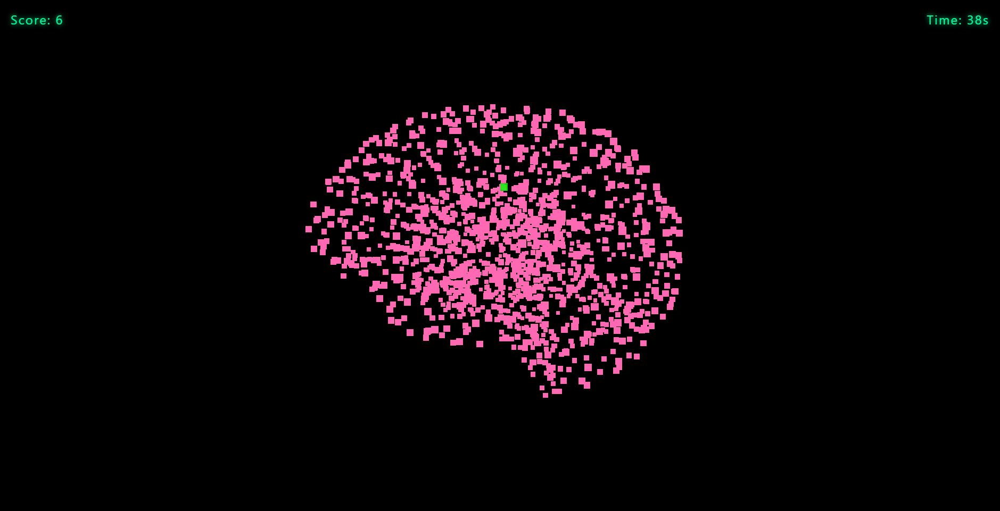
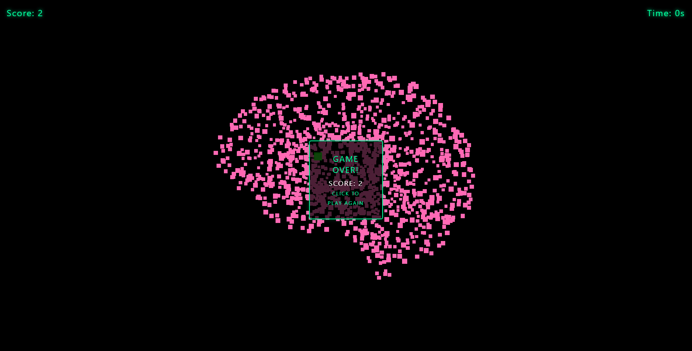

# BrainWashed

**BrainWashed** est un jeu interactif en 3D construit avec Three.js, dans lequel les joueurs doivent cliquer sur des points verts apparaissant de façon aléatoire sur un modèle 3D de cerveau pour gagner des points avant la fin du compte à rebours. Le jeu intègre une musique de fond diffusée depuis YouTube, offrant une expérience immersive à l’utilisateur.

## Table des Matières
- [À propos du projet](#à-propos-du-projet)
- [Fonctionnalités](#fonctionnalités)
- [Comment jouer](#comment-jouer)
- [Déroulé du jeu](#déroulé-du-jeu)
- [Technologies utilisées](#technologies-utilisées)
- [Améliorations possibles](#améliorations-possibles)
- [Créateurs](#créateurs)
- [Crédits](#crédits)

## À propos du projet
**BrainWashed** est une application ludique et interactive qui améliore la réactivité des utilisateurs en les invitant à cliquer rapidement sur des points apparaissant sur un modèle 3D de cerveau. À chaque instant, un point devient vert, et l’utilisateur doit cliquer dessus avant qu’il ne disparaisse. Le jeu dure un temps limité, au bout duquel le score final est affiché. La musique de fond, diffusée depuis une vidéo YouTube, contribue à rendre l’expérience plus engageante.

## Fonctionnalités
- **Modèle 3D interactif** : Les utilisateurs peuvent tourner et zoomer sur le modèle de cerveau.
- **Mécanisme de score** : Les points changent de couleur en vert aléatoirement, et cliquer dessus augmente le score.
- **Compte à rebours** : La partie dure un temps déterminé, avec un minuteur affiché à l’écran.
- **Interface dynamique** : Le score et le temps restant sont mis à jour en temps réel.
- **Effet sonore** : Le jeu diffuse des sons lorsqu'un click est correct.

## Comment jouer

Accéder à ce lien et vous pourrez immédiatement jouer : 

  https://effetdoppler.github.io/Brainwashed/

## Déroulé du jeu

- Démarrez la partie en cliquant sur le bouton Commencer le jeu.
- Un point sur le modèle de cerveau deviendra vert de façon aléatoire.
- Cliquez sur ce point vert aussi vite que possible pour gagner des points.

- Le point changera de position après chaque clic réussi, alors continuez de cliquer sur les nouveaux points verts jusqu’à la fin du compte à rebours.
- Quand le temps est écoulé, votre score final est affiché, et vous pouvez recommencer une nouvelle partie.

## Technologies utilisées

- Three.js : Pour le rendu du modèle 3D de cerveau et la création de points interactifs.
- JavaScript : Pour la logique de jeu, la mise à jour de l’interface utilisateur et la gestion des événements.
- HTML/CSS : Pour la structure et le style de base du jeu.

## Améliorations possibles

- Niveaux de difficulté : Ajouter différents niveaux de difficulté avec des vitesses et des tailles de points variées.
- Ajout de niveau : Ajouter des niveaux autre que le cerveau afin d'avoir plus ou moins de points.
- Bonus multiplicateur : Récompenser les clics réussis à la suite avec des scores bonus ou un multiplicateur.

## Créateurs

- Charles Zhang (Interface, Codrops, Effet sonore)
- Denis Adde (Gameplay, readme)

## Crédits

- Modèle de cerveau 3D : https://poly.pizza/m/5mPRPZkI3qt
- Sites utilisé pour implémenter les sons en fond : https://www.youtube.com/watch?v=91sjdKmqxdE&ab_channel=flanniganable et https://threejs.org/docs/#api/en/audio/Audio
- Site utilisé pour le codrops : https://tympanus.net/codrops/2021/08/31/surface-sampling-in-three-js/
- Créé avec Three.js
